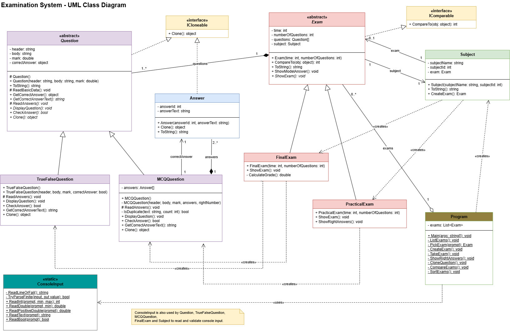

# Examination System (OOP)

A console application written in C# that lets a teacher create exams (Final or Practical) for a subject, and lets a student take them. It was built to practice object-oriented programming: abstraction, inheritance, polymorphism, encapsulation, and the `ICloneable` and `IComparable` interfaces.

## Features

- Create an **exam** for a subject (subject name + subject ID), either:
  - **Final exam**: each question is True/False or MCQ. The student gets a grade (marks and percentage), and the right answer is shown for every wrong answer.
  - **Practical exam**: MCQ questions only. There is no grade; the right answers are shown at the end.
- **List** the exams created in the current run.
- **Take an exam** from the menu.
- Show an exam with its **right answers** (model answer) without asking anything.
- Demonstrate **`ICloneable`**: deep-copy a question, edit the copy, and prove the original did not change.
- Demonstrate **`IComparable`**: compare two exams, or sort all exams, by number of questions.
- Input is validated everywhere (numbers in range, marks greater than 0, no empty text, `true`/`false`), and an MCQ question refuses **duplicate answers**.

> The exams live in memory only: they are lost when the program closes.

## The menu

```
========== EXAMINATION SYSTEM ==========
1. Create an exam (Final / Practical)
2. List the exams
3. Take an exam
4. Show an exam with its right answers
5. Clone a question (ICloneable)
6. Compare two exams (IComparable)
7. Sort the exams by number of questions (IComparable)
0. Exit
```

Option 1 asks for the subject name and ID, then the exam type, the time, the number of questions, and the data of every question.

## Requirements

- [.NET SDK 10](https://dotnet.microsoft.com/download) (the projects target `net10.0`)

## Run

From the solution folder:

```bash
dotnet run --project "Examination System _ OOP"
```

Or from the project folder (the one that contains `Examination System _ OOP.csproj`):

```bash
dotnet run
```

Or open the solution in Visual Studio and press **F5**.

## Input rules

| Input | Accepted values |
|---|---|
| Menu choice, exam type, question type, answer numbers | A whole number inside the shown range |
| Exam time, number of questions, number of answers | Whole numbers (time and questions at least 1, answers at least 2) |
| Mark | A number greater than 0. Use a dot as the decimal separator (`2.5`), on any computer language setting |
| Texts (subject, header, body, answers) | Not empty. An MCQ answer cannot repeat another answer of the same question (case and spaces are ignored) |
| True/False answers | `true`, `t`, `false` or `f`, in any letter case |

Every question keeps asking until the value is valid. If the input stream is closed (for example Ctrl+Z), the program stops with an `InvalidOperationException`.

## Classes

| Class | Kind | Role |
|---|---|---|
| `Question` | abstract, `ICloneable` | Header, body, mark and right answer. Each type reads, shows, checks and clones itself. |
| `TrueFalseQuestion` | derives from `Question` | The right answer is a `bool`. |
| `MCQQuestion` | derives from `Question` | Has an array of `Answer`; the right answer is one of them. `Clone()` is a deep copy. |
| `Answer` | `ICloneable` | One choice of an MCQ question: an ID and a text. |
| `Exam` | abstract, `IComparable` | Time, number of questions, questions, and subject. Exams are compared by number of questions. |
| `FinalExam` | derives from `Exam` | True/False + MCQ questions, with a grade. |
| `PracticalExam` | derives from `Exam` | MCQ questions only, shows the right answers at the end. |
| `Subject` | | Name, ID and one exam. `CreateExam()` builds the exam the user chooses. |
| `ConsoleInput` | static helper | Reads and validates whole numbers, decimals, positive decimals, text and booleans from the console. |
| `Program` | | The menu. |

### OOP concepts used

- **Abstraction:** `Question` and `Exam` are abstract and define what every type must do (`DisplayQuestion`, `CheckAnswer`, `GetCorrectAnswerText`, `ShowExam`, ...).
- **Inheritance:** `TrueFalseQuestion` and `MCQQuestion` extend `Question`; `FinalExam` and `PracticalExam` extend `Exam`.
- **Polymorphism:** an exam works with `Question` objects only. For example, `GetCorrectAnswerText()` lets any exam print a right answer without checking the question type.
- **Encapsulation:** private fields with properties; setters validate (`Time`, `NumberOfQuestions` and `Mark`).
- **`ICloneable`:** `Answer` and `Question` can be copied. `MCQQuestion.Clone()` also clones the answers.
- **`IComparable`:** `Exam.CompareTo` compares by number of questions, so `Array.Sort` works on exams.

## Project structure

```
Examination System _ OOP/                  (solution folder)
├── Examination System _ OOP/              (the console application)
│   ├── Examination System _ OOP.csproj
│   ├── Program.cs
│   ├── Subject.cs
│   ├── Exam.cs
│   ├── FinalExam.cs
│   ├── PracticalExam.cs
│   ├── Question.cs
│   ├── TrueFalseQuestion.cs
│   ├── MCQQuestion.cs
│   ├── Answer.cs
│   └── ConsoleInput.cs
├── ExaminationSystemTests/                (xUnit test project)
│   ├── ExaminationSystemTests.csproj
│   ├── TestHelpers.cs
│   ├── ConsoleInputTests.cs
│   ├── QuestionTests.cs
│   ├── ExamTests.cs
│   ├── SubjectTests.cs
│   └── ProgramTests.cs
├── Examination_System___UML.drawio        (class diagram, editable)
├── Examination_System___UML.drawio.png    (class diagram, image)
├── .gitattributes
├── .gitignore
└── Examination System _ OOP.slnx
```

## Tests

`ExaminationSystemTests` is an xUnit project in the same solution. It tests every class and the whole menu (the tests type into the console and read what the program prints). It covers valid and invalid input, the grade calculation, the deep clone, and the sorting and comparing of exams.

From the solution folder:

```bash
dotnet test
```

or use **Test Explorer** in Visual Studio (**Test > Run All Tests**).

## Example session

```
Your choice: 1

Subject name: Math
Subject ID: 1
Choose exam type (1 = Final, 2 = Practical): 1
Exam time (minutes): 30
Number of questions: 2

--- Question 1 ---
Type (1 = True/False, 2 = MCQ): 1
Enter the header of the question: Q1
Enter the body of the question: The sky is blue
Enter the mark for the question: 2
Enter the correct answer for the question (true/false): true

--- Question 2 ---
Type (1 = True/False, 2 = MCQ): 2
Enter the header of the question: Q2
Enter the body of the question: What is 2 + 3?
Enter the mark for the question: 3
Number of answers (2 or more): 3
Answer 1: Four
Answer 2: Five
Answer 3: Six
Right answer number (1-3): 2

Exam created: FinalExam - Time: 30 minutes, Number of Questions: 2, Subject: Math
```

Taking the exam (option 3):

```
===== FINAL EXAM: Math (30 min) =====

--- Question 1 of 2 ---
True/False Question:
Question: Q1
Body: The sky is blue
Mark: 2
Enter your answer (true/false): true
Correct!

--- Question 2 of 2 ---
MCQ Question:
Question: Q2
Body: What is 2 + 3?
Mark: 3
1. Four
2. Five
3. Six
Enter the number of your answer: 1
Incorrect. Right answer: 2. Five

Grade: 2 / 5
Percentage: 40%
```

## Class diagram



